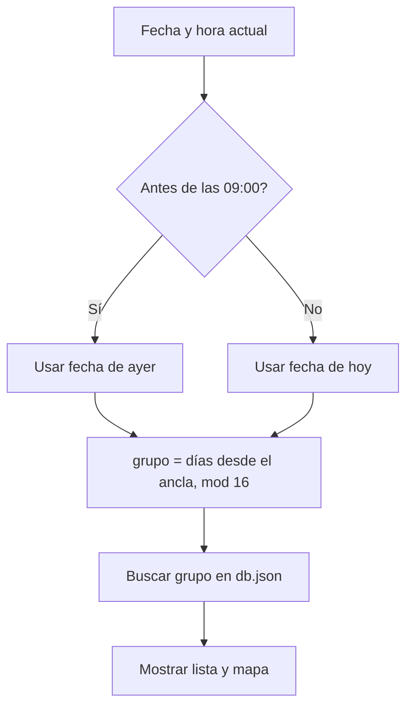
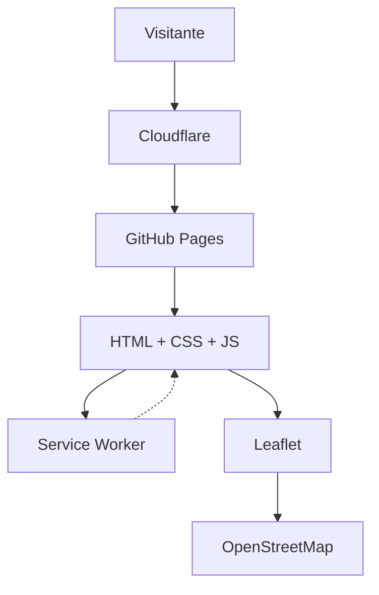
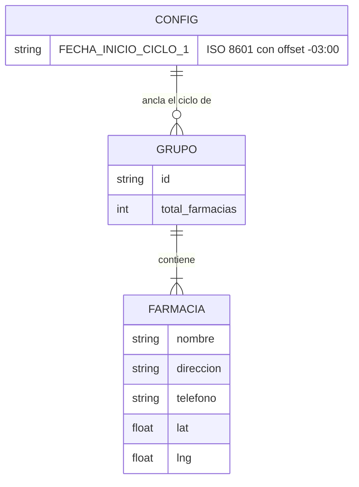
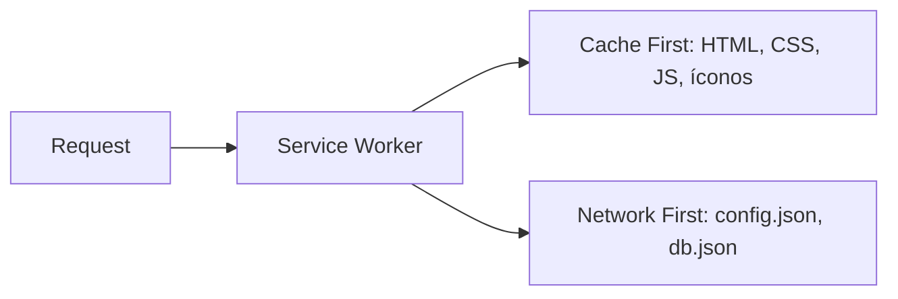

# Farmacias de Turno MDP

<div align="center">  </div>

> PWA estática que calcula la rotación diaria de farmacias de turno en Mar del Plata, Argentina, mediante un modelo matemático determinístico. Sin backend, sin dependencias.

[](https://farmaciasmdp.com.ar/)
[](https://github.com/psbella/farmaciasmdp/actions/workflows/tests.yml)
[](https://github.com/psbella/farmaciasmdp)
[](https://creativecommons.org/licenses/by-nc/4.0/)
[](https://web.dev/progressive-web-apps/)
[](https://github.com/psbella/farmaciasmdp)
[](https://developer.mozilla.org/es/docs/Web/HTML)
[](https://developer.mozilla.org/es/docs/Web/CSS)
[](https://developer.mozilla.org/es/docs/Web/JavaScript)
[](https://leafletjs.com/)
[](https://pages.github.com/)
[](https://www.cloudflare.com/)

**→ [farmaciasmdp.com.ar](https://farmaciasmdp.com.ar)**

---

## Tabla de contenidos

- [Descripción](#descripción)
- [Cómo funciona la rotación](#cómo-funciona-la-rotación)
- [Arquitectura del sistema](#arquitectura-del-sistema)
- [Estructura del proyecto](#estructura-del-proyecto)
- [Stack tecnológico](#stack-tecnológico)
- [Modelo de datos](#modelo-de-datos)
- [Estrategia de caché (PWA)](#estrategia-de-caché-pwa)
- [Tests y CI](#tests-y-ci)
- [Panel de administración](#panel-de-administración)
- [Instalación local](#instalación-local)
- [Proyectos relacionados](#proyectos-relacionados)
- [Licencia](#licencia)

---

## Descripción

El Colegio de Farmacéuticos de General Pueyrredon organiza las farmacias de Mar del Plata en **16 grupos rotativos**. Esta aplicación replica esa lógica de forma completamente local: dado un punto de ancla conocido (`FECHA_INICIO_CICLO_1`, en `config.json`) y la fecha actual, se calcula el grupo de turno con una operación de módulo. No hay llamadas a APIs externas para determinar el turno.

La app es instalable como PWA (Android, desktop e iOS vía instrucciones propias), funciona offline gracias a un Service Worker, y está optimizada para SEO con Schema.org, Open Graph y sitemap.

---

## Cómo funciona la rotación

```
grupo_hoy = ((diasDesde(FECHA_INICIO_CICLO_1, ahora) % 16) + 16) % 16 + 1
```

El cambio de turno ocurre a las **09:00 hs (hora de Argentina)**. Si el usuario consulta antes de esa hora, se usa el grupo del día anterior. La doble operación de módulo evita resultados negativos para fechas anteriores al ancla.



---

## Arquitectura del sistema

La aplicación es **100% estática**: no existe servidor de aplicaciones. GitHub Pages sirve los archivos, Cloudflare actúa como CDN y proxy DNS, y toda la lógica de negocio corre en el navegador del usuario.



---

## Estructura del proyecto

```
farmaciasmdp/
├── index.html                  # Entry point — contenido SSG para SEO + bootstrap JS
├── admin-map.html              # Panel interno para auditar/editar coordenadas
├── privacidad.html             # Política de privacidad
├── terminos.html               # Términos de uso
│
├── config.json                 # Fecha ancla del ciclo
│                                #   { "FECHA_INICIO_CICLO_1": "2026-04-25T09:00:00-03:00" }
├── db.json                     # Base de datos de farmacias
│                                #   { "1": [ {nombre, direccion, telefono, lat, lng}, ... ],
│                                #     ..., "16": [...], "farmacias_extra": [...] }
├── manifest.json                # Web App Manifest (PWA)
├── sw.js                        # Service Worker — estrategia de caché multi-capa
│
├── css/                         # Estilos, un archivo por sección
│   ├── base.css · header.css · layout.css · cards.css · maps.css
│   ├── controls.css · footer.css · responsive.css · components.css
│   ├── banner.css · privacidad.css · terminos.css · admin.css
│
├── js/                          # Lógica del sitio público, un módulo ES6 por responsabilidad
│   ├── main.js                  # Entry point — orquesta todo lo demás
│   ├── config.js                # Carga config.json y expone FECHA_INICIO_CICLO_1
│   ├── data.js                  # Cálculo de ciclo/turno, carga de db.json
│   ├── maps.js                  # Mapa Leaflet, marcadores, popups
│   ├── ui.js                    # Render de tarjetas, bottom sheet mobile
│   ├── theme.js                 # Dark/light mode
│   ├── install.js               # Botón "Instalar como app" + modal iOS
│   ├── escape.js                # Sanitización de HTML para datos de farmacias
│   ├── analytics.js             # Google Analytics (gtag)
│   ├── legal-theme.js           # Tema claro/oscuro en privacidad.html / terminos.html
│   ├── scroll-top.js            # Botón flotante "ir arriba"
│   ├── sw-update.js             # Registro y actualización del Service Worker
│   │
│   └── admin/                   # Lógica del panel de administración (admin-map.html)
│       ├── main.js · config.js · state.js · dom.js · estado.js
│       ├── auth.js               # Login con token de GitHub
│       ├── mapa.js               # Mapa, Google Maps embebido, búsqueda Nominatim
│       ├── farmacias.js          # Navegación y edición de cada farmacia
│       └── github.js             # Serializa y guarda db.json vía la Contents API
│
├── images/
│   ├── icon-16/32/48/96/128/192/512.png   # Íconos PWA en todos los tamaños
│   └── icon-source.svg                     # Vector fuente de los íconos
│
├── tests/                        # Tests unitarios (node:test, sin dependencias)
│   ├── ciclo.test.mjs             # Cálculo de rotación
│   ├── github-serializer.test.mjs # Serialización de db.json del panel admin
│   └── README.md                  # Cómo correrlos y por qué hace falta fijar el TZ
│
├── .github/workflows/tests.yml   # CI: corre npm test en cada push/PR
├── package.json                  # Solo declara "type": "module" y el script test
│
├── sitemap.xml · robots.txt      # SEO / crawlers
├── ads.txt                       # Autorización Google AdSense
├── CNAME                         # → farmaciasmdp.com.ar
├── CHANGELOG.md                  # Historial de versiones (Keep a Changelog + SemVer)
└── LICENSE                       # CC BY-NC 4.0
```

---

## Stack tecnológico

| Capa | Tecnología | Notas |
|---|---|---|
| Markup | HTML5 | Contenido SSG inline para SEO; Schema.org embebido |
| Estilos | CSS3 + Custom Properties | Dark/light mode sin JS, mobile-first, dividido por sección en `css/` |
| Lógica | JavaScript ES6+ Modules | Sin frameworks, sin bundler, sin dependencias de npm |
| Mapas | Leaflet 1.9.x + OpenStreetMap | Marcadores SVG personalizados |
| PWA | Service Worker + Web App Manifest | Cache API, instalable en Android/desktop/iOS |
| Tests | `node:test` (nativo de Node) | Cero dependencias externas |
| CI | GitHub Actions | Corre los tests en cada push y PR |
| Hosting | GitHub Pages | Deploy en cada push a `main` |
| CDN / DNS | Cloudflare | HTTPS, caché edge, analytics |
| SEO | Schema.org · Open Graph · Twitter Cards | Structured data + sitemap.xml |
| Fuentes | Google Fonts | Bebas Neue (display) + Nunito (body) |
| Monitoreo | Google Search Console · Cloudflare Analytics | Sin cookies propias |

---

## Modelo de datos



**Notas sobre la calidad de los datos:**

- `db.json` tiene 171 farmacias únicas (por nombre + dirección) repartidas en 16 grupos, más una clave `farmacias_extra` (13 entradas) fuera del ciclo rotativo.
- `MITRE (Colón 2690)` aparece en los 16 grupos — es farmacia de turno permanente.
- La edición de coordenadas/datos se hace desde el [panel de administración](#panel-de-administración), no a mano.

---

## Estrategia de caché (PWA)



El manifest declara `display: standalone` y `start_url: /`, por lo que la app se comporta como nativa una vez instalada. El botón "Instalar como app" (`js/install.js`) escucha el evento `beforeinstallprompt` en Android/desktop, y muestra un modal con instrucciones manuales en iOS (donde ese evento no existe). El registro del Service Worker (`js/sw-update.js`) y el `<link rel="manifest">` en `index.html` son los dos requisitos que Chrome exige para ofrecer la instalación.

---

## Tests y CI

Tests unitarios con `node:test`, incluido en Node — sin dependencias externas, coherente con el resto del proyecto. Cubren la lógica que no depende de un navegador: el cálculo de rotación de turno y la serialización de `db.json` que hace el panel de administración. Ver [`tests/README.md`](tests/README.md) para el detalle de qué cubren y por qué.

```bash
TZ=America/Argentina/Buenos_Aires npm test
```

El workflow [`tests.yml`](.github/workflows/tests.yml) corre esto mismo en GitHub Actions en cada push a `main` y en cada Pull Request.

---

## Panel de administración

`admin-map.html` es una herramienta interna (no pública, requiere un token de GitHub) para revisar y corregir nombre, dirección, teléfono y coordenadas de cada farmacia una por una, con mapa Leaflet, vista embebida de Google Maps y búsqueda de dirección vía Nominatim. Guarda los cambios directo en `db.json` a través de la Contents API de GitHub — no hay backend propio ni base de datos.

---

## Instalación local

> **Requisito**: servir con un servidor HTTP local. Los módulos ES6 y el Service Worker no funcionan con `file://`.

```bash
# Clonar el repositorio
git clone https://github.com/psbella/farmaciasmdp.git
cd farmaciasmdp

# Opción A — Python (sin instalar nada)
python3 -m http.server 8080

# Opción B — Node.js
npx serve .

# Opción C — VS Code + extensión Live Server
# Clic derecho en index.html → "Open with Live Server"
```

Luego abrir `http://localhost:8080` en el navegador.

---

## Proyectos relacionados

| Proyecto | Descripción |
|---|---|
| [remedi.ar](https://remedi.ar) | Buscador de precios de medicamentos en farmacias de Argentina |

---

## Licencia

Distribuido bajo [Creative Commons BY-NC 4.0](https://creativecommons.org/licenses/by-nc/4.0/).
Podés usar y adaptar el código con atribución, pero no con fines comerciales.

---

<div align="center">
  Hecho en Mar del Plata, Argentina
</div>
